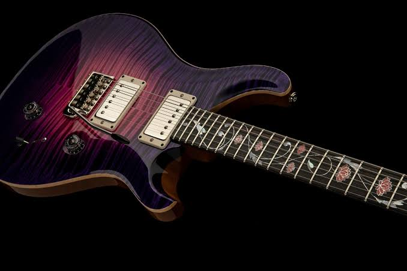

# Electric Guitar

## Overview

The electric guitar is one of the most influential instruments in modern music. Unlike an acoustic guitar, it uses magnetic pickups to convert string vibrations into electrical signals that are sent to an amplifier. This allows musicians to produce a wide variety of sounds, from clean and bright tones to heavily distorted effects commonly heard in rock and metal music.

Electric guitars are used in many genres, including rock, blues, jazz, pop, country, and metal. Their versatility has made them a favorite among performers and recording artists for decades. Players can customize their sound by adjusting amplifier settings or using effects such as delay, chorus, overdrive, and distortion. Because of these options, the electric guitar is often chosen by musicians who enjoy experimenting with different tones and musical styles.

## Key Components

An electric guitar typically includes:

- Magnetic pickups
- Volume and tone controls
- A solid or semi-hollow body
- Six strings
- An output jack for connecting to an amplifier

## Advantages

One of the biggest advantages of an electric guitar is its flexibility. Musicians can create a wide range of sounds simply by changing amplifier settings or using different effects pedals. This makes the electric guitar a great choice for players who perform multiple styles of music or enjoy creating their own unique tone.

> "The electric guitar transformed popular music by giving musicians nearly unlimited possibilities for shaping their sound."

## Related Topics

To continue learning about electric guitars, explore [[Acoustic Guitar]], [[guitar amplifiers]], [[Overdrive Pedals]], [[Distortion Pedals]], [[bass guitar]], and [[guitar maintenance]]. These topics explain the equipment, effects, and maintenance that help musicians get the most out of their instrument.