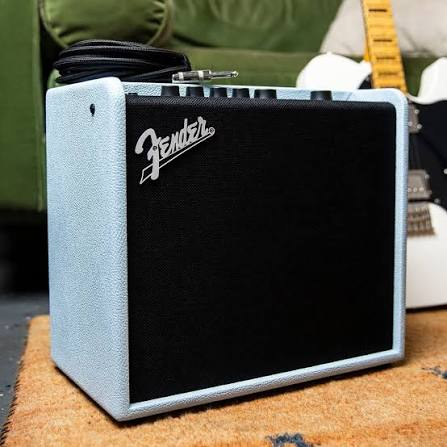

# Guitar Amplifiers

## Overview

A guitar amplifier is an essential piece of equipment for most electric guitar and bass guitar players. Its primary purpose is to increase the volume of the instrument so it can be heard clearly during practice, recording sessions, or live performances. However, modern amplifiers do much more than simply make a guitar louder. They also shape the tone of the instrument by emphasizing different frequencies and allowing musicians to add effects such as distortion, reverb, and delay.

Amplifiers come in a variety of sizes and power levels. Small practice amplifiers are designed for home use, while larger amplifiers are built for concerts and professional performances. Some musicians prefer traditional tube amplifiers because of their warm sound, while others choose solid-state or digital modeling amplifiers for their reliability and versatility. Selecting the right amplifier depends on the player's musical style, budget, and performance needs.

## Common Types

Common amplifier options include:

- Tube amplifiers
- Solid-state amplifiers
- Digital modeling amplifiers
- Practice amplifiers
- Performance amplifiers

## Choosing an Amplifier

When choosing an amplifier, musicians should consider where they plan to play, the type of music they enjoy, and the features they need. A small practice amplifier is usually enough for learning at home, while larger amplifiers provide the volume needed for rehearsals and live performances. Many modern amplifiers also include built-in effects and multiple sound settings, making them a versatile choice for players of all skill levels.

> "An amplifier is more than a speaker—it becomes part of a musician's signature sound."

## Related Topics

To continue learning about guitar equipment, explore [[Electric Guitar]], [[bass Guitar]], [[Acoustic Guitar]], [[Overdrive Pedals]], [[Distortion Pedals]], and [[guitar maintenance]]. These topics explain how amplifiers work with different instruments and effects to create a wide variety of sounds.