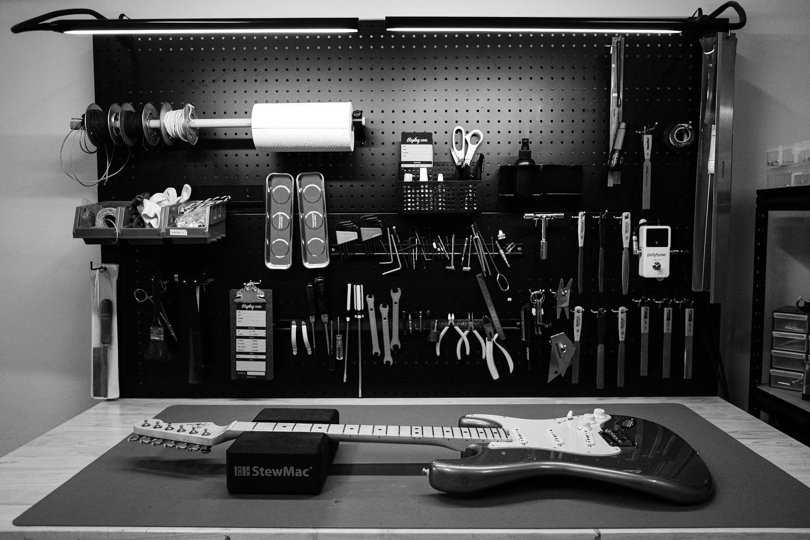

# Guitar Maintenance

## Overview

Proper guitar maintenance helps an instrument perform well and last for many years. Whether someone owns an acoustic guitar, electric guitar, or bass guitar, regular care keeps the instrument comfortable to play and helps prevent unnecessary repairs. Simple tasks such as cleaning the strings, wiping down the body, and storing the guitar in a safe environment can make a noticeable difference over time.

One of the most common maintenance tasks is replacing old strings. As strings age, they lose brightness, become harder to tune, and may eventually break. Musicians should also inspect the neck, bridge, tuning machines, and frets to make sure everything is functioning properly. Keeping a guitar in a room with stable temperature and humidity helps prevent the wood from warping or cracking. Learning these basic maintenance habits allows musicians to spend more time playing and less time dealing with avoidable problems.

## Maintenance Tips

To keep a guitar in good condition:

- Clean the strings after each practice session.
- Replace worn or rusty strings.
- Store the guitar in a case when not in use.
- Avoid extreme heat, cold, or humidity.
- Check the tuning and hardware regularly.

## Common Mistakes to Avoid

Even small mistakes can shorten the life of a guitar. Avoid leaving your instrument in a hot car, exposing it to excessive humidity, or neglecting regular string changes. Cleaning your guitar regularly and storing it properly will help keep it looking and sounding its best for years.

> "Taking care of your instrument today helps ensure it will sound its best tomorrow."

## Related Topics

Proper maintenance is important for every type of guitar. Continue learning by exploring [[Acoustic Guitar]], [[Electric Guitar]], [[bass guitar]], [[Guitar Amplifiers]], and [[Overdrive Pedals]]. Understanding how to care for both your instrument and equipment helps ensure reliable performance and great sound.