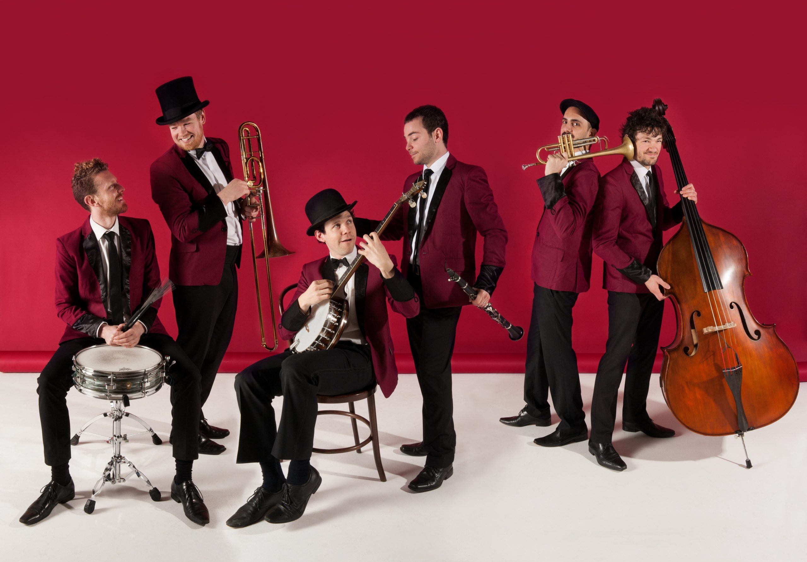

---
title: Jazz
date: 2026-07-22
---

# Jazz

## Overview

Jazz is a genre known for improvisation, creativity, and complex harmonies. It originated in the early 1900s and has influenced countless styles of music around the world. Jazz musicians often focus on developing strong listening skills and musical expression, making every performance unique.

Although jazz is commonly associated with clean guitar tones, some players use chorus and delay effects to add depth and texture to their sound. The genre encourages musicians to experiment, communicate with one another, and create music through improvisation rather than simply following written notes.

## What Makes Jazz Unique

Some of the defining characteristics of jazz include:

- Improvisation
- Swing rhythms
- Complex chord progressions
- Musical interaction
- Dynamic performances

## Famous Jazz Artists

Some of the most influential jazz musicians include:

- Louis Armstrong
- Miles Davis
- Duke Ellington
- Ella Fitzgerald
- Wes Montgomery

> "Jazz allows musicians to express themselves through improvisation."

## Related Topics

To continue learning about jazz music, explore [[Electric Guitar]], [[Chorus Pedals]], [[Delay Pedals]], [[Blues]], and [[Recording & Production]]. These topics explain the instruments, effects, and recording techniques that help shape the unique sound of jazz.
Learn more by visiting [[electric guitar]], [[Chorus Pedals]], [[Delay Pedals]], [[Live Performance Tips]], and [[Rock]].