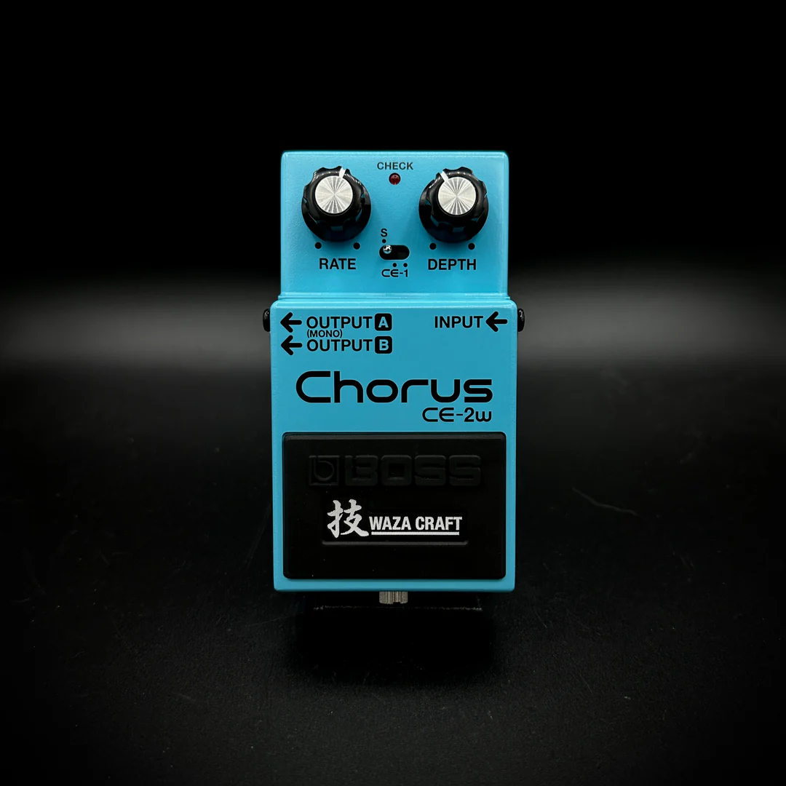

---
title: Chorus Pedals
date: 2026-07-22
---

# Chorus Pedals

## Overview

A chorus pedal creates the illusion that multiple guitars are playing at the same time. It works by slightly changing the timing and pitch of the original signal, producing a fuller and wider sound. Chorus became especially popular during the 1980s and continues to be widely used in many styles of music today.

Many clean guitar tones benefit from chorus because it adds richness without creating heavy distortion. Bass players also use chorus to give their instrument more depth and movement. Whether used subtly or as a noticeable effect, chorus can make a guitar sound more spacious and expressive.

## Key Features

Some characteristics of chorus pedals include:

- Thickens clean guitar tones
- Creates a wider sound
- Adjustable rate and depth controls
- Popular for rhythm guitar
- Common in rock, pop, and worship music

## When to Use a Chorus Pedal

Chorus pedals work especially well with clean or lightly overdriven guitar tones. They are commonly used for rhythm playing, arpeggios, and ambient sounds that need extra depth. Many musicians combine chorus with delay or reverb to create a fuller, more immersive sound.

> "Sometimes a small amount of chorus is all it takes to make a guitar sound bigger."

## Related Topics

To continue learning about guitar effects, explore [[Electric Guitar]], [[Bass Guitar]], [[Delay Pedals]], [[Rock]], and [[Live Performance Tips]]. These topics explain how chorus pedals are used alongside other equipment to create a wide variety of sounds.