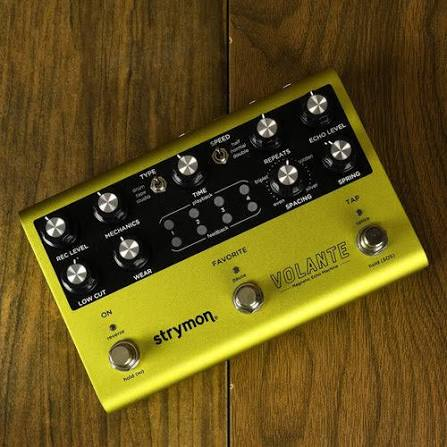

---
title: Delay Pedals
date: 2026-07-22
---

# Delay Pedals

## Overview

Delay pedals repeat the sound of each note after it is played, creating an echo effect. Depending on the settings, the repeats can be subtle or very noticeable. Delay is commonly used to add depth, atmosphere, and rhythm to guitar playing without overpowering the original sound.

Many musicians use delay during solos, ambient music, worship music, and classic rock. It can make simple melodies sound much bigger and more expressive while helping fill the space between notes. Modern delay pedals often include multiple delay modes and adjustable settings, giving players a wide range of creative possibilities.

## Key Features

Some characteristics of delay pedals include:

- Creates repeating echoes
- Adjustable delay time
- Controls for feedback and mix
- Adds depth to solos
- Useful for many music styles

## When to Use a Delay Pedal

Delay pedals are commonly used for guitar solos, ambient passages, and clean rhythm parts that need extra depth. Many musicians combine delay with chorus or reverb to create a fuller sound, while others use short delay settings to add subtle texture without making the effect obvious.

> "A well-used delay pedal fills empty space without getting in the way."

## Related Topics

To continue learning about guitar effects, explore [[Electric Guitar]], [[Guitar Amplifiers]], [[Chorus Pedals]], [[Rock]], [[Jazz]], and [[Live Performance Tips]]. These topics explain how delay pedals work with different instruments, effects, and musical styles to create unique sounds.