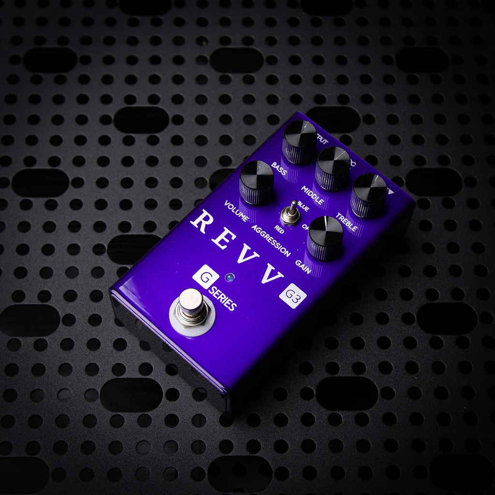

---
title: Distortion Pedals
date: 2026-07-22
---

# Distortion Pedals

## Overview

Distortion pedals create a heavier and more aggressive sound than overdrive pedals. They produce higher levels of gain, making them popular in hard rock, punk, and metal music. Distortion gives guitar riffs more power and sustain while helping solos stand out in a mix.

Many famous guitarists rely on distortion pedals to achieve their signature sound. When paired with a quality amplifier, a distortion pedal can produce everything from crunchy rhythm tones to high-gain lead sounds. By adjusting the pedal's controls, musicians can create sounds that range from classic rock to modern metal.

## Key Features

Some characteristics of distortion pedals include:

- High gain output
- Thick and powerful sound
- Increased sustain
- Controls for Gain, Tone, and Level
- Popular in rock and metal music

## When to Use a Distortion Pedal

Distortion pedals are commonly used for powerful rhythm guitar parts, lead solos, and heavy riffs. They work especially well with electric guitars and high-powered amplifiers, making them a favorite for musicians who want a bold, aggressive tone. Many players combine distortion with other effects to create even more dynamic sounds.

> "Distortion adds power and energy that can completely transform a guitar's sound."

## Related Topics

To continue learning about guitar effects, explore [[Electric Guitar]], [[Guitar Amplifiers]], [[Overdrive Pedals]], [[Metal]], and [[Rock]]. These topics explain how distortion is used alongside different instruments and equipment to create a wide range of powerful guitar tones.