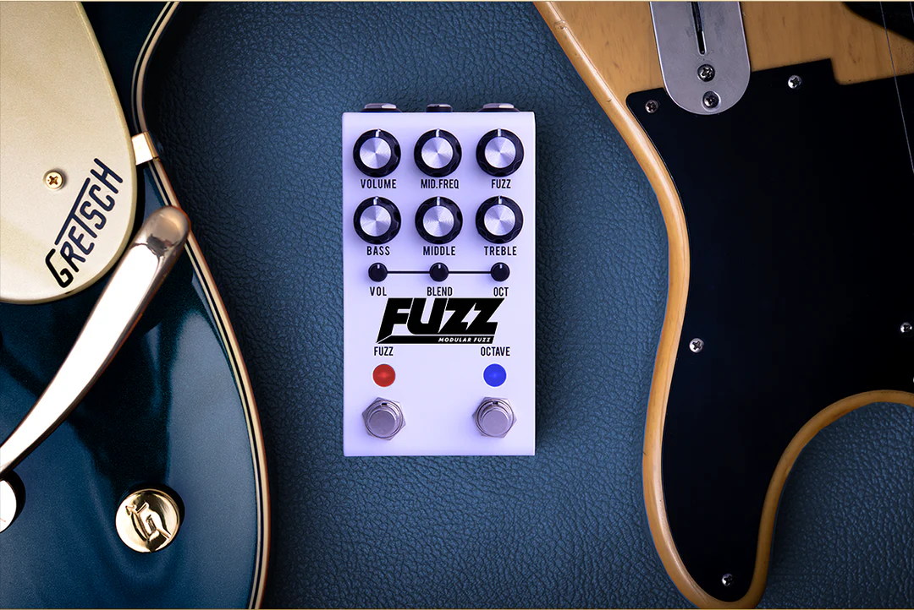

---
title: Fuzz Pedals
date: 2026-07-22
---

# Fuzz Pedals

## Overview

Fuzz pedals are known for producing a thick, gritty, and heavily saturated guitar tone. They were among the first guitar effects ever created and became extremely popular during the 1960s and 1970s. Unlike overdrive or distortion pedals, fuzz creates a more aggressive sound by clipping the guitar signal in a unique way, giving it a raw and vintage character.

Many legendary guitarists have used fuzz pedals to create unforgettable tones. While they are often associated with classic rock and psychedelic music, fuzz pedals continue to be used in modern rock, alternative, and experimental genres. Their distinctive sound makes them a favorite for musicians looking to create bold, expressive guitar tones.

## Key Features

Some characteristics of fuzz pedals include:

- Thick and saturated sound
- Vintage-style distortion
- Long sustain
- Great for solos and riffs
- Popular in rock and psychedelic music

## When to Use a Fuzz Pedal

Fuzz pedals are ideal for players who want a bold, vintage-inspired guitar tone. They work well for expressive solos, powerful riffs, and experimental sounds that stand out in a mix. Many musicians pair fuzz pedals with tube amplifiers to capture the classic tones heard on countless rock recordings.

> "Fuzz pedals create bold tones that helped define the sound of classic rock."

## Related Topics

To continue learning about guitar effects, explore [[Electric Guitar]], [[Guitar Amplifiers]], [[Distortion Pedals]], [[Rock]], and [[Metal]]. These topics explain how fuzz pedals work alongside other effects and equipment to create a wide variety of powerful guitar sounds.