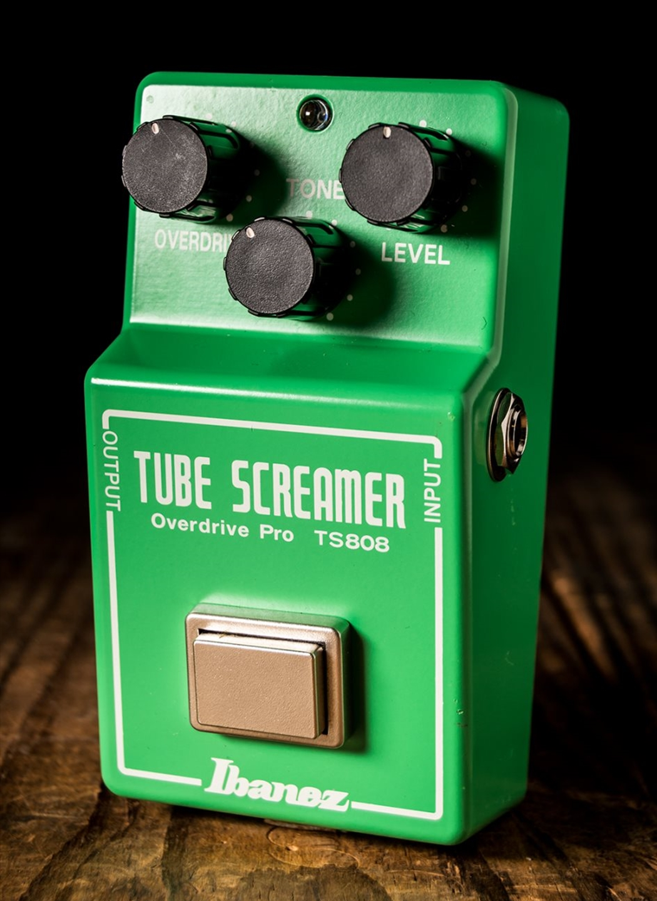

# Overdrive Pedals

Overdrive pedals are one of the most popular effects used by guitarists. They are designed to add a warm, slightly distorted sound that mimics the natural breakup of a tube amplifier when the volume is turned up. Because of this, overdrive pedals are used in many styles of music, including blues, rock, country, and classic rock.

Unlike heavier distortion effects, overdrive keeps much of the original tone of the guitar while adding extra sustain and a smoother, more dynamic sound.

## How Overdrive Works

An overdrive pedal increases the gain of your guitar signal, causing the sound to become more saturated. The harder you play, the more the effect responds, making it feel very natural.

Most overdrive pedals include controls for:

- **Drive** – Adjusts the amount of overdrive.
- **Tone** – Changes the brightness or warmth of the sound.
- **Level** – Controls the overall output volume.

Many players use an overdrive pedal as an "always on" effect to give their clean tone a little extra warmth.

## Common Uses

Overdrive pedals are commonly used for:

- Blues guitar solos
- Classic rock rhythm guitar
- Boosting an amplifier for more sustain
- Tightening the sound before a distortion pedal
- Adding warmth to clean guitar tones

## Popular Overdrive Pedals

Some of the best-known overdrive pedals include:

- Ibanez Tube Screamer
- Boss SD-1 Super OverDrive
- Fulltone OCD
- Wampler Tumnus
- MXR Timmy Overdrive

Each pedal has its own unique character, but they all provide smooth, musical overdrive.

## Choosing an Overdrive Pedal

When selecting an overdrive pedal, consider:

- The type of music you play
- Whether you use a clean or already-driven amplifier
- How much gain you need
- The tone you want to achieve

Many guitarists even stack two overdrive pedals together to create different levels of gain.

## Related Topics

- [[electric guitar]]
- [[guitar amplifiers]]
- [[Distortion Pedals]]
- [[Blues]]
- [[Rock]]