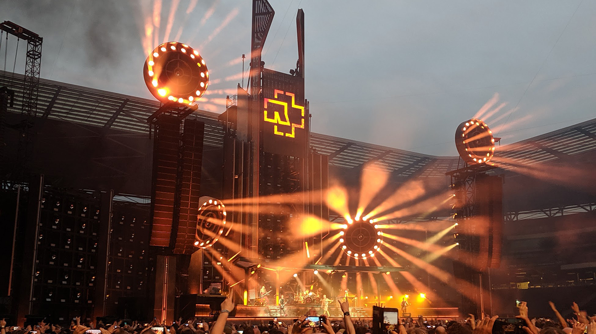

---
title: Stage Setup
date: 2026-07-22
---

# Stage Setup

## Overview

A well-organized stage setup helps musicians perform comfortably and reduces the chances of technical problems during a show. Proper placement of amplifiers, microphones, pedals, and cables makes it easier to move around the stage while keeping equipment safe and organized.

Many musicians arrange their pedalboards so their most frequently used effects are easy to reach. Keeping cables neat also reduces the risk of accidental disconnections and tripping hazards. Taking a few extra minutes to organize equipment before a performance can make the entire show run more smoothly.

## Essential Stage Equipment

A typical stage setup may include:

- Guitar or bass
- Amplifier
- Pedalboard
- Microphone
- Instrument and power cables
- Tuner

## Setting Up for Success

Before a performance, musicians should test every piece of equipment, secure loose cables, and verify that pedals and amplifiers are working properly. A final sound check helps ensure that instruments are balanced with the rest of the band and that any technical issues are resolved before the audience arrives.

> "An organized stage lets musicians focus on the performance instead of the equipment."

## Related Topics

To continue learning about live performances, explore [[Live Performance Tips]], [[Guitar Amplifiers]], [[Overdrive Pedals]], [[Distortion Pedals]], and [[Electric Guitar]]. These topics explain the equipment and preparation that help musicians perform with confidence.