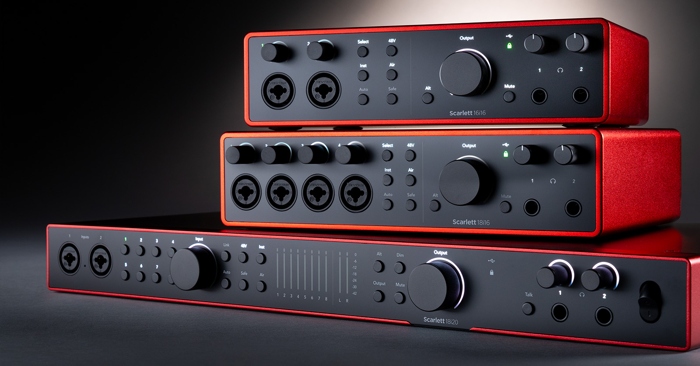

# Audio Interfaces

## Overview

An audio interface connects instruments and microphones to a computer. It converts analog sound into digital audio that recording software can process. Audio interfaces are essential for musicians who want better sound quality than a computer's built-in microphone.

Many audio interfaces include microphone preamps, headphone outputs, instrument inputs, and direct monitoring controls that allow musicians to record and listen with minimal delay. They are commonly used in home studios, professional recording studios, and live streaming setups.

## Key Features

Some common features of audio interfaces include:

- XLR microphone inputs
- Instrument inputs
- Headphone output
- USB connection
- Low-latency recording

## Choosing an Audio Interface

When selecting an audio interface, musicians should consider how many instruments or microphones they plan to record at the same time. Beginners often need only a two-input interface, while larger recording projects may require additional inputs and outputs. Compatibility with recording software and overall sound quality are also important factors.

> "An audio interface is the bridge between your instrument and your computer."

## Related Topics

To continue learning about home recording, explore [[Home Studio Basics]], [[Digital Audio Workstations (DAWs)]], [[Microphones]], and [[Electric Guitar]]. These topics explain the equipment and software commonly used to create high-quality recordings.