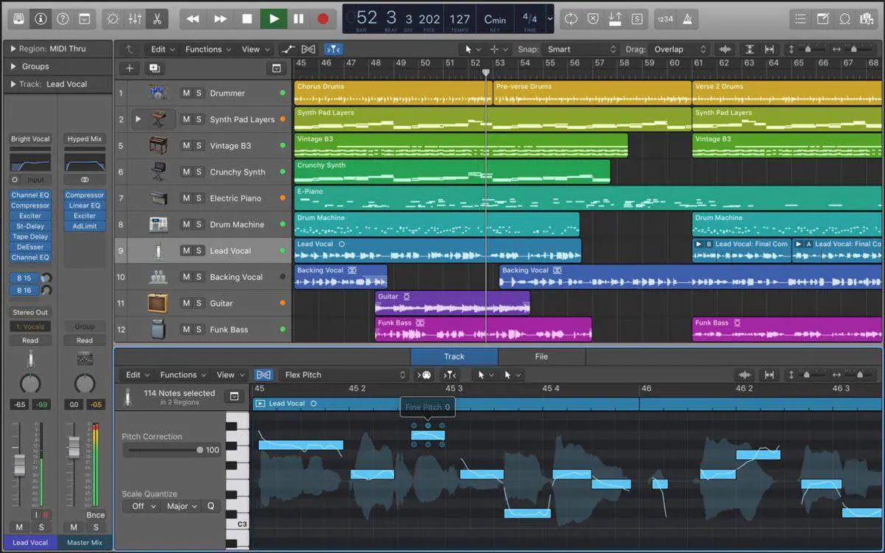

---
title: Digital Audio Workstations (DAWs)
date: 2026-07-22
---

# Digital Audio Workstations (DAWs)

## Overview

A Digital Audio Workstation, commonly called a DAW, is software used to record, edit, mix, and produce music. Popular DAWs include Logic Pro, Pro Tools, Ableton Live, FL Studio, and Reaper. Although each program offers different features and workflows, they all allow musicians to create complete recordings from start to finish.

Learning a DAW takes time, but it becomes one of the most valuable tools for recording and producing music. Whether creating demos, recording a full band, or editing podcasts, a DAW gives users the flexibility to turn ideas into professional-quality projects.

## Key Features

Some common features found in most DAWs include:

- Multi-track recording
- Audio editing
- MIDI support
- Mixing tools
- Built-in effects

## Choosing a DAW

When selecting a DAW, musicians should consider their experience level, budget, and the type of projects they plan to create. Some DAWs are designed for beginners with simple interfaces, while others provide advanced tools for professional music production. The best choice is the one that fits your workflow and creative goals.

> "A DAW turns musical ideas into finished recordings."

## Related Topics

To continue learning about music production, explore [[Home Studio Basics]], [[Audio Interfaces]], [[Microphones]], and [[Live Performance Tips]]. These topics explain the equipment and techniques commonly used to record, edit, and produce high-quality audio.