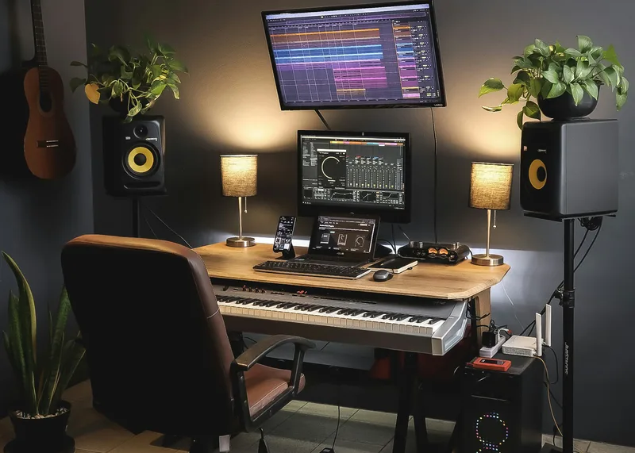

# Home Studio Basics

## Overview

A home studio gives musicians the ability to record music without renting professional studio time. While some studios can become very advanced, many beginners can produce high-quality recordings using only a computer, an audio interface, a microphone, and recording software.

A well-organized recording space also helps reduce unwanted noise and improves the overall recording experience. With the right equipment and a little practice, musicians can record demos, podcasts, vocals, and full songs from the comfort of their own home.

## Essential Equipment

A basic home studio typically includes:

- Computer
- Audio interface
- Microphone
- Studio headphones
- Recording software

## Setting Up Your Home Studio

When creating a home studio, choose a quiet room with minimal background noise and enough space for your equipment. Organizing cables, positioning microphones correctly, and monitoring recordings through quality headphones can make a noticeable difference in the final sound. As your experience grows, you can gradually add more equipment to expand your recording setup.

> "A simple studio with the right equipment is often better than an expensive studio that isn't used."

## Related Topics

To continue learning about home recording, explore [[Audio Interfaces]], [[Digital Audio Workstations (DAWs)]], [[Microphones]], and [[Electric Guitar]]. These topics explain the equipment and techniques commonly used to create high-quality recordings.