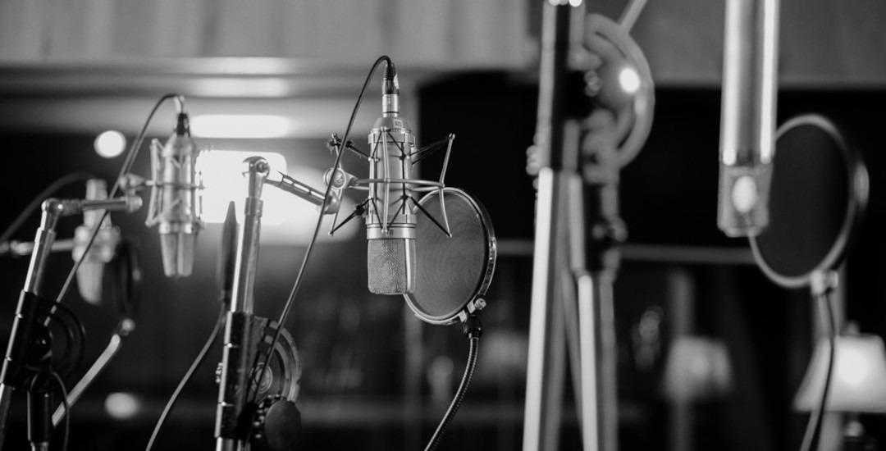

# Microphones

## Overview

Microphones capture sound and convert it into an electrical signal for recording or live performances. Different microphones are designed for different situations. Dynamic microphones are commonly used on stage because they are durable and handle loud sound well, while condenser microphones are popular for studio vocals and acoustic instruments because of their sensitivity and clarity.

Choosing the right microphone can greatly improve the quality of a recording. Understanding how different microphone types work helps musicians select the best option for their recording or performance needs.

## Common Types

Some of the most common microphone types include:

- Dynamic microphones
- Condenser microphones
- USB microphones
- Ribbon microphones
- Instrument microphones

## Choosing the Right Microphone

When selecting a microphone, consider where it will be used and what you plan to record. Dynamic microphones are a great choice for live performances, while condenser microphones are often preferred for studio recordings because they capture more detail. USB microphones are convenient for beginners, podcasts, and home recording setups since they connect directly to a computer without requiring additional equipment.

> "The right microphone captures the performance the way it was meant to be heard."

## Related Topics

To continue learning about recording equipment, explore [[home-studio]], [[audio-interfaces]], [[daws]], and [[acoustic guitar]]. These topics explain the tools and techniques used to capture high-quality sound in both home and professional studios.